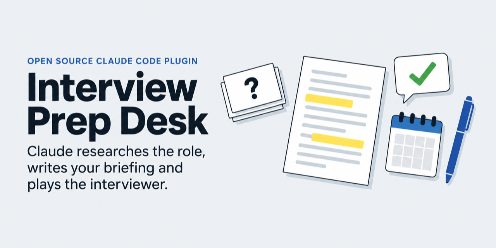

# Interview Prep Desk



A Claude Code plugin that keeps your interview prep in one private dashboard and does the research for you.

Add an interview from a job link. Every morning a routine researches the company and the role, then writes a briefing, 15 likely questions with answers built from your CV, a quiz and flashcards into your dashboard. There you work through a checklist, drill the cards and rehearse in a practice chat: Claude plays the interviewer, pushes back on vague answers and shows you a stronger answer built only from your real experience.

New here? The [step-by-step guide](docs/guide.md) takes you from install to interview day, with the exact commands and screenshots.

> Status: early (core 0.1.2). Built for personal use and shared as is.

## What you get

- **Dashboard**: a private claude.ai artifact with your interview list, briefing, FAQ, quiz, flashcards, checklist and notes. Your data stays in the artifact's own database.
- **Morning prep**: a routine that prepares every interview in the next 7 days, plus any interview you queue.
- **Practice chat**: a mock interview in the dashboard's Mock interview tab. After each answer you get feedback, a stronger answer and a follow-up question, and at the end a hiring verdict with three things to fix.
- **Voice mock (optional add-on)**: `interview-prep-desk-voice` builds a NotebookLM notebook with an Audio Overview in which two interviewers question you. It is a separate plugin because it relies on an unofficial community tool; see its [README](plugins/interview-prep-desk-voice/README.md).

## Requirements

- Claude Code (the terminal, an IDE extension or the desktop app's Code tab) with artifact publishing that supports the `db` and `sample` capabilities. Availability depends on your Claude plan and organization settings. The plugin does not run in claude.ai chat or Cowork.
- For the morning prep: claude.ai routines (`/schedule`), or scheduled tasks in the Claude desktop app.
- For the voice add-on: the Claude desktop app and [gemini-notebook-mcp-cli](https://github.com/jacob-bd/gemini-notebook-mcp-cli), an unofficial community MCP server for NotebookLM (now Gemini Notebook). It signs in with your Google browser cookies and can stop working when Google changes the service.

## Install

```bash
claude plugin marketplace add dantonoli/interview-prep-desk
claude plugin install interview-prep-desk@interview-prep-desk
```

With Claude Code 2.1.275 or later you can also add and install in one step from inside a session: `/plugin install interview-prep-desk --marketplace dantonoli/interview-prep-desk`.

Then, in Claude Code:

```
/interview-prep-desk:setup
```

Setup publishes your own private copy of the dashboard, saves your CV to it without contact details, and schedules the morning prep. It asks before each step.

Optional voice add-on (it installs the core plugin too if needed):

```bash
claude plugin install interview-prep-desk-voice@interview-prep-desk
```

Then run `/interview-prep-desk-voice:setup`.

## Everyday use

| You want to | Do this |
|---|---|
| Add an interview | `/interview-prep-desk:add-interview <job link>`, or the dashboard's Add interview button |
| Prepare one now instead of tomorrow morning | `/interview-prep-desk:prep <company>` |
| Build the voice mock now (add-on) | `/interview-prep-desk-voice:voice-mock <company>` |
| Update your dashboard to the latest version | `/interview-prep-desk:setup update` |

The guide's [cheat sheet](docs/guide.md#cheat-sheet) also lists what you can ask for in your own words.

To get a new version later, run `claude plugin update interview-prep-desk@interview-prep-desk`, then `/interview-prep-desk:setup update` so your dashboard gets the new page too.

## Privacy

Your CV and interviews live in your private artifact's database in your own claude.ai account. Nothing is sent to the plugin's author. Research queries go to web search, and the practice chat sends your CV, the job and the briefing to Claude on your account. The voice add-on uploads your CV and the job to NotebookLM. Sharing the dashboard shares all of it. The full privacy policy is [docs/privacy.md](docs/privacy.md).

## Limits

- Artifacts cannot embed NotebookLM or use the microphone. In the practice chat you type, or use your computer's dictation.
- Some job sites block automated reading. Paste the job description instead.
- The prep only knows what your CV says. Add your numbers to the profile; missing ones show up as `[add figure]`.

## Support and security

Questions and bug reports: [GitHub issues](https://github.com/dantonoli/interview-prep-desk/issues). Security problems: report them privately, see [SECURITY.md](SECURITY.md).

## How it works

[docs/architecture.md](docs/architecture.md) covers the components and trust boundaries, and [the data model](plugins/interview-prep-desk/reference/data-model.md) says which part owns each field.

## Credits

Inspired by a public post describing an interview prep workflow with Claude and NotebookLM.

## License

[MIT](LICENSE)
