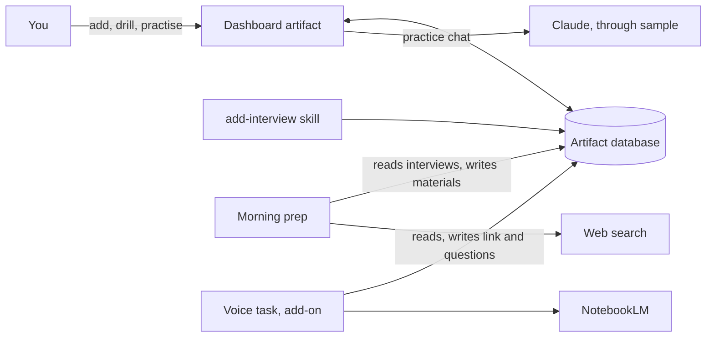

# Architecture

## Components

Users install the core plugin, `plugins/interview-prep-desk`, and optionally the voice add-on, `plugins/interview-prep-desk-voice`. The field-by-field contract is [the data model](../plugins/interview-prep-desk/reference/data-model.md).

| Component | Plugin | Runs where | What it does |
|---|---|---|---|
| Dashboard (`dashboard/interview-prep-desk.html`) | core | claude.ai artifact viewer, in a browser or the Claude app | Shows and edits everything. Keeps state in the artifact database (`db`). Runs the practice chat through `sample`, on the viewer's Claude usage. |
| `setup` skill | core | The user's Claude Code session | Publishes the dashboard as a private artifact, saves the profile, writes the local config, schedules the morning prep after the user confirms. |
| `add-interview` skill | core | The user's Claude Code session | Reads a job posting and writes a new interview record. |
| Morning prep (`templates/prep-routine.md`) | core | A claude.ai routine in the cloud, or a scheduled task in the Claude desktop app | Picks the interviews that need prep, researches them on the web and writes the materials. |
| Voice setup and task (`templates/voice-routine.md`) | voice add-on | A scheduled task in the Claude desktop app on the user's computer | Builds a NotebookLM notebook and a role-play Audio Overview, then writes the link and the questions back. `settings/voice` tells the dashboard to show the voice controls. |

The components never call each other. They meet in one place: the dashboard's database.

## Trust boundaries

- **Everything outside the prompt is data.** Job postings, web pages, NotebookLM output and database rows can contain text that looks like instructions. Every template says to treat them as data.
- **The artifact is private by default.** Only the owner can open it until they share it. Anyone the owner shares it with sees the CV and all materials.
- **Routines act as the user.** They run on the user's Claude account and may read and write the dashboard database. Each template lists the fields it is allowed to write.
- **No developer backend.** The plugins have no server, collect no telemetry and send nothing to their author.
- **Some data leaves the dashboard.** Web search sees research queries. The practice chat and the prep send the CV, the job and the briefing to Claude on the user's account. With the voice add-on, NotebookLM (Google) receives the CV and the job.
- **NotebookLM access is unofficial.** The voice add-on uses a community MCP server that signs in with Google browser cookies. That is why it is a separate plugin that is not submitted to Anthropic's directory.

## Where it runs

Only Claude Code has the tools the skills need: the Artifact and ArtifactData tools, a file system for the config file, and scheduling. Every skill checks this first and stops with a clear message in claude.ai chat or in Cowork.

## Known limits

- Artifacts cannot embed other sites (no NotebookLM player) or use the microphone.
- Many job sites block automated reading. The skills then use the pasted description and web search.
- Google Workspace accounts may not be allowed to share NotebookLM notebooks publicly.
- Desktop scheduled tasks run only while the app is open and the computer is awake.

## End-to-end check

A change is done when this path works on a test artifact:

1. Run `/interview-prep-desk:setup` with `examples/profile.example.md`.
2. Add `examples/interview.example.json`, or a real job link with `/interview-prep-desk:add-interview`.
3. Run `/interview-prep-desk:prep` for it. The dashboard shows the briefing, FAQ, quiz and cards.
4. Open the Mock interview tab and start the practice chat. The interviewer greets you and asks question 1. No voice controls show yet.
5. With the voice add-on, run `/interview-prep-desk-voice:setup`, then `/interview-prep-desk-voice:voice-mock`. The tab shows the voice controls, the NotebookLM link and the questions.
