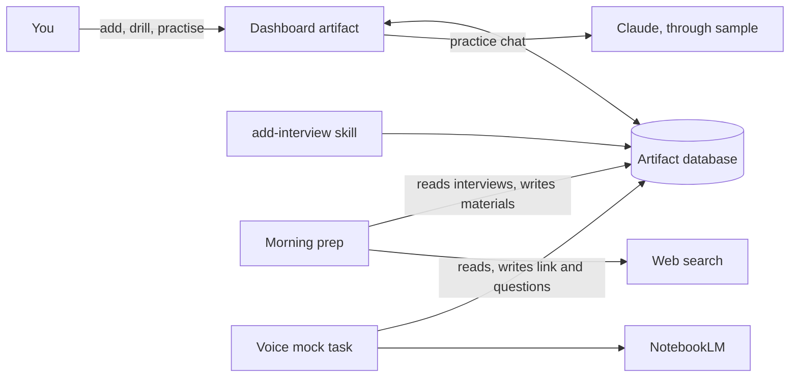

# Architecture

## Components

| Component | Runs where | What it does |
|---|---|---|
Everything a user installs is in `plugin/`. The field-by-field contract is [plugin/reference/data-model.md](../plugin/reference/data-model.md).

| Component | Runs where | What it does |
|---|---|---|
| Dashboard (`plugin/dashboard/interview-prep-desk.html`) | claude.ai artifact viewer, in a browser or the Claude app | Shows and edits everything. Keeps state in the artifact database (`db`). Runs the practice chat through `sample`, on the viewer's Claude usage. |
| `setup` skill | The user's Claude Code session | Publishes the dashboard as a private artifact, saves the profile, writes the local config, schedules the routines. |
| `add-interview` skill | The user's Claude Code session | Reads a job posting and writes a new interview record. |
| Morning prep (`plugin/templates/prep-routine.md`) | A claude.ai routine in the cloud, or a scheduled task in the Claude desktop app | Picks the interviews that need prep, researches them on the web and writes the materials. |
| Voice mock (`plugin/templates/voice-routine.md`) | A scheduled task in the Claude desktop app on the user's computer | Builds a NotebookLM notebook and a role-play Audio Overview, then writes the link and the questions back. |

The components never call each other. They meet in one place: the dashboard's database.

## Trust boundaries

- **Everything outside the prompt is data.** Job postings, web pages, NotebookLM output and database rows can contain text that looks like instructions. Every template says to treat them as data.
- **The artifact is private by default.** Only the owner can open it until they share it. Anyone the owner shares it with sees the CV and all materials.
- **Routines act as the user.** They run on the user's Claude account and may read and write the dashboard database. Each template lists the fields it is allowed to write.
- **Some data leaves the dashboard.** Web search sees research queries. NotebookLM (Google) receives the CV and the job when the voice mock is on. The practice chat sends the CV, the job and the briefing to Claude.
- **NotebookLM access is unofficial.** The voice mock uses a community MCP server that signs in with Google browser cookies. It is optional and contained in one task.

## Known limits

- Artifacts cannot embed other sites (no NotebookLM player) or use the microphone.
- Many job sites block automated reading. The skills then use the pasted description and web search.
- Google Workspace accounts may not be allowed to share NotebookLM notebooks publicly.
- Desktop scheduled tasks run only while the app is open and the computer is awake.

## End-to-end check

A change is done when this path works on a test artifact:

1. Run `/interview-prep-desk:setup` with `examples/profile.example.md`.
2. Add `examples/interview.example.json`, or a real job link with `/interview-prep-desk:add-interview`.
3. Run `/interview-prep-desk:prep` for it. The dashboard shows the briefing, FAQ, quiz and cards.
4. Open the Mock interview tab and start the practice chat. The interviewer greets you and asks question 1.
5. With the voice mock set up, run `/interview-prep-desk:voice-mock`. The tab shows the NotebookLM link and the questions.
