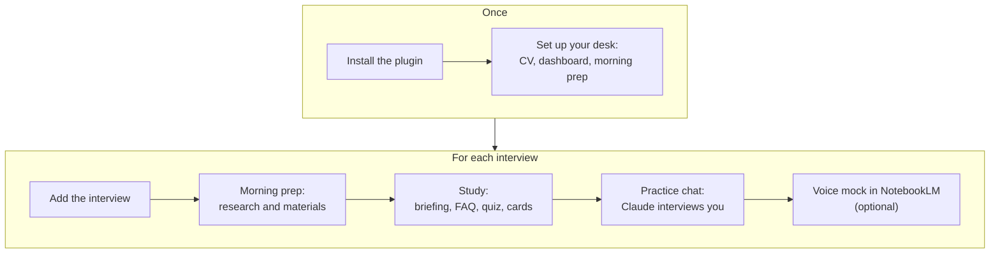
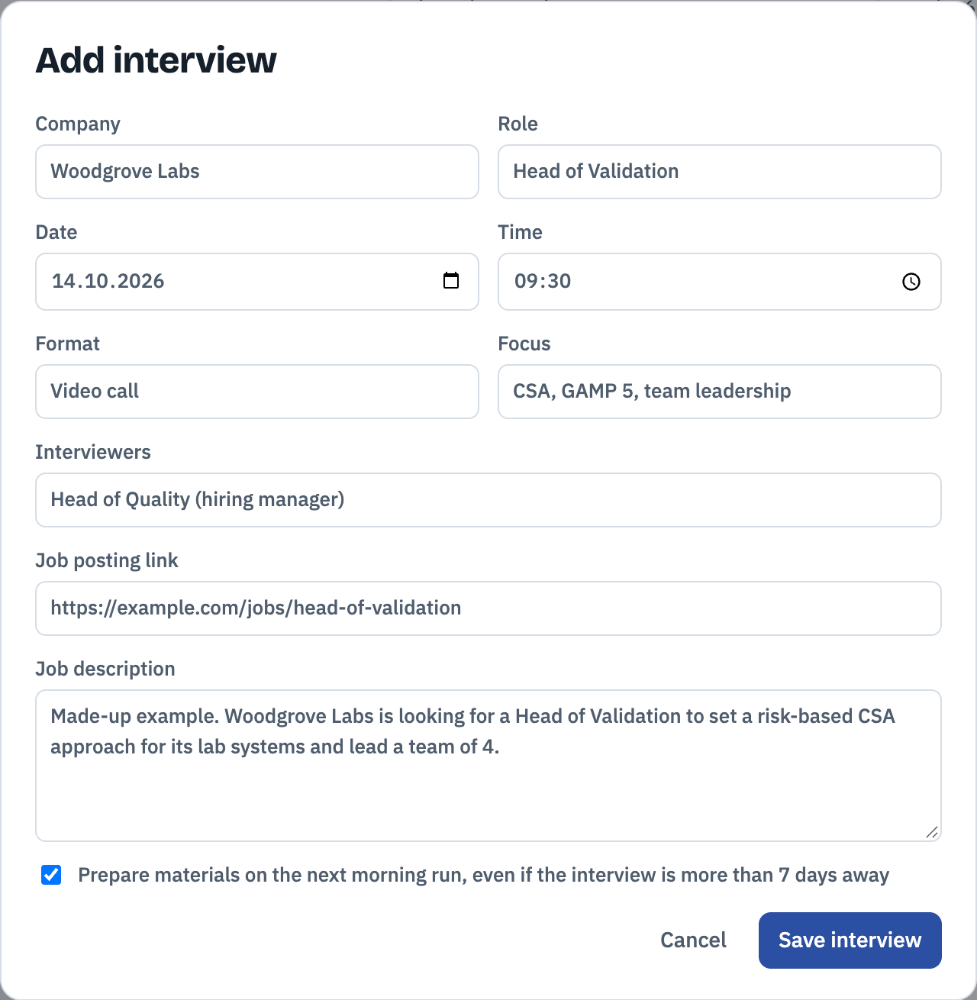
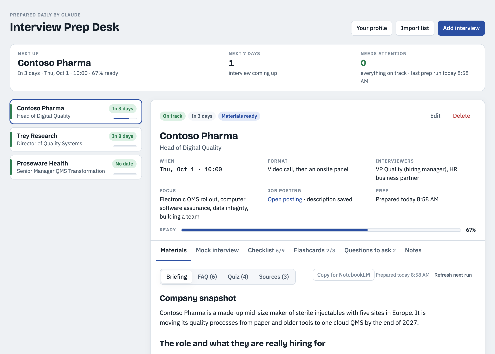
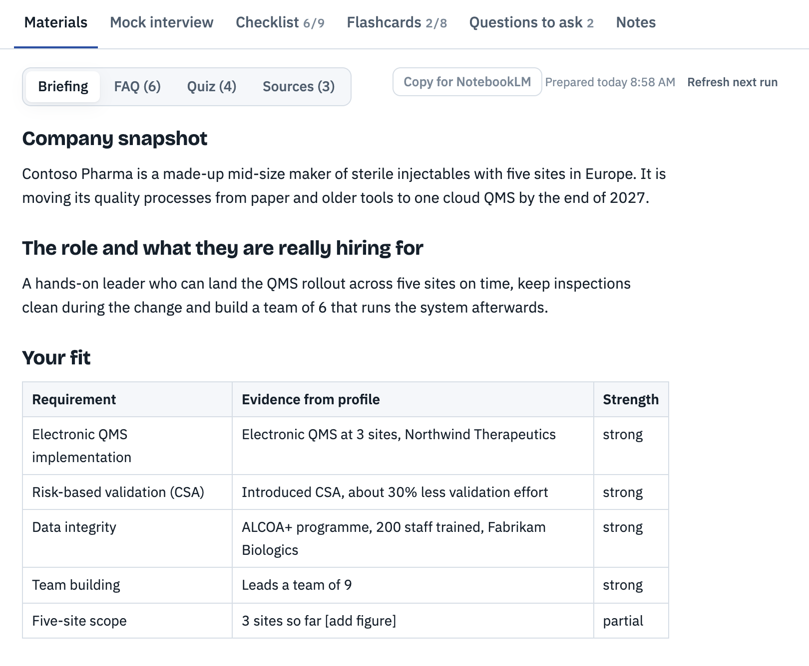
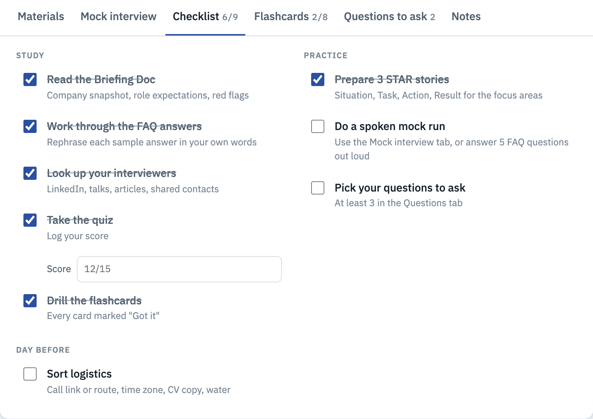
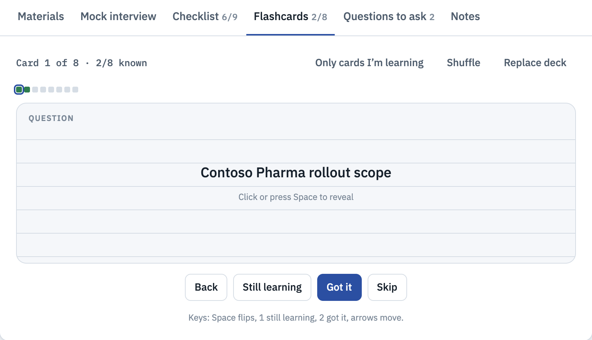
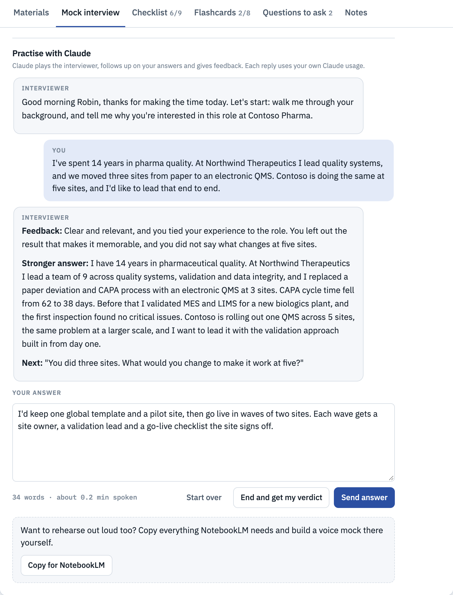
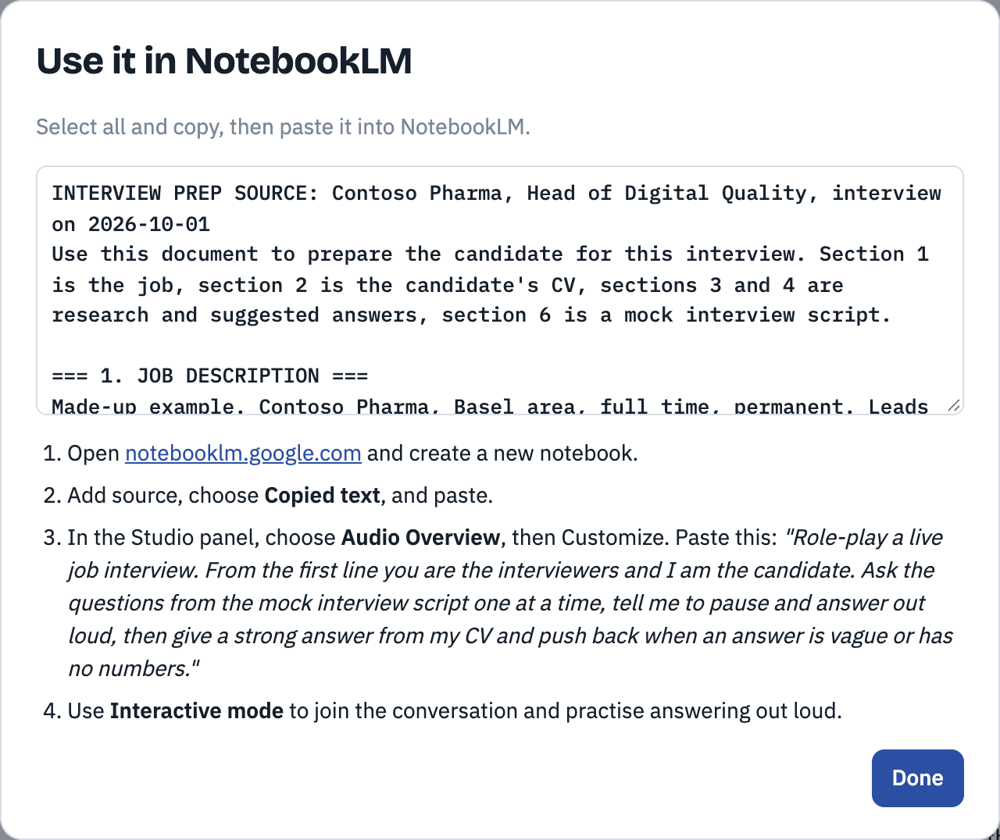
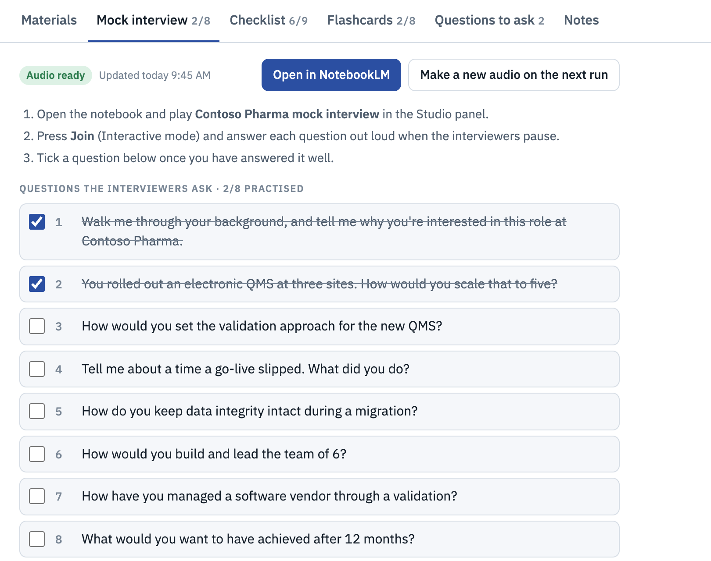

# Interview Prep Desk guide

This guide takes you from installing the plugin to walking into the interview, with the exact commands to type at each step. The screenshots use made-up data: Robin Muster and the companies are invented.

**Contents**

1. [How it works](#how-it-works)
2. [Before you start](#before-you-start)
3. [Step 1. Install](#step-1-install)
4. [Step 2. Set up your desk](#step-2-set-up-your-desk)
5. [Step 3. Add an interview](#step-3-add-an-interview)
6. [Step 4. Get the prep](#step-4-get-the-prep)
7. [Step 5. Study in the dashboard](#step-5-study-in-the-dashboard)
8. [Step 6. Rehearse in the practice chat](#step-6-rehearse-in-the-practice-chat)
9. [Step 7. Rehearse out loud in NotebookLM](#step-7-rehearse-out-loud-in-notebooklm)
10. [A week before the interview](#a-week-before-the-interview)
11. [Keep it up to date](#keep-it-up-to-date)
12. [Your data](#your-data)
13. [Troubleshooting](#troubleshooting)
14. [Cheat sheet](#cheat-sheet)

## How it works

You work in two places. In **Claude Code** you type the commands. The **dashboard** is a private page in your own claude.ai account that holds your CV, your interviews and everything prepared for them. A routine prepares each interview every morning, so most days you only open the dashboard.



## Before you start

- **Claude Code**: the terminal, an IDE extension or the Code tab of the Claude desktop app. The commands do not run in claude.ai chat or in Cowork, because they need Claude Code's artifact and file tools.
- **A Claude plan that can publish artifacts with a database and Claude calls** (the `db` and `sample` capabilities). Availability depends on your plan and your organization's settings.
- **Your CV** as a PDF, Word, Markdown or text file, or ready to paste.
- **For the daily prep**: claude.ai routines (`/schedule`), or the Claude desktop app for a scheduled task on your computer.
- **For the voice mock add-on only**: the Claude desktop app, a Google account with NotebookLM, and [gemini-notebook-mcp-cli](https://github.com/jacob-bd/gemini-notebook-mcp-cli). You can also build a voice mock by hand without the add-on; see [step 7](#step-7-rehearse-out-loud-in-notebooklm).

## Step 1. Install

In a terminal:

```bash
claude plugin marketplace add dantonoli/interview-prep-desk
```

```bash
claude plugin install interview-prep-desk@interview-prep-desk
```

With Claude Code 2.1.275 or later you can do both from inside a session instead:

```
/plugin install interview-prep-desk --marketplace dantonoli/interview-prep-desk
```

Start a new Claude Code session afterwards so the new commands load.

## Step 2. Set up your desk

In Claude Code, type:

```
/interview-prep-desk:setup
```

Setup only starts when you type the command; Claude never starts it by itself. It first explains what it creates and asks whether to continue, then asks four questions:

| Setup asks for | Example answer |
|---|---|
| Your CV | `~/Documents/cv.pdf`, or paste the text |
| The name the interviewers should use | `Robin` |
| Your timezone, as an IANA name | `Europe/Zurich` |
| The time of the morning prep | `08:55` (the default) |

Then it:

1. **Saves your CV without contact details.** It converts the CV to Markdown and removes email addresses, phone numbers, the street address, the date of birth, photo references and personal links. It keeps every job, date, figure and skill as written, and tells you what it removed.
2. **Publishes your dashboard**: a private claude.ai artifact with its own database. Your CV goes into that database.
3. **Writes a small config file**, `~/.config/interview-prep-desk/config.json`, with the dashboard link, your name and your timezone, so the other commands find your dashboard.
4. **Offers to schedule the morning prep**, and creates nothing until you confirm:
   - a **cloud routine** (recommended): runs even when your computer is off;
   - a **desktop scheduled task**: runs only while the Claude desktop app is open and the computer is awake.
5. **Gives you the dashboard link.** Bookmark it and keep it private: anyone you share the dashboard with sees your CV.

> **Tip:** the prep only knows what your CV says. Add your numbers, such as team sizes, budgets and results, in the dashboard's **Your profile** dialog. Where a number is missing, the answers say `[add figure]`.

## Step 3. Add an interview

**With a command.** Pass the job link:

```
/interview-prep-desk:add-interview https://example.com/jobs/head-of-digital-quality
```

**In your own words.** Claude recognizes the request, so you can also write, for example:

> Add this job to my interview prep: https://example.com/jobs/head-of-digital-quality. The interview is on 1 October at 10:00, a video call with the VP Quality and an HR business partner.

**When the job site blocks reading**, paste the description instead of the link: type `/interview-prep-desk:add-interview` followed by the text.

Claude reads the posting, then saves:

- the company name without legal suffixes (for example "Contoso Pharma", not "Contoso Pharma Holding AG") and the role without gender or workload markers;
- a **summary of the posting in its own words**, not a copy, with the link;
- 4 to 6 **focus** themes the interview will probably probe;
- the date, time, format and interviewers, if you gave them.

If the same company and role already exist, it asks whether to update that interview instead. The new interview is queued for the next morning prep.

**In the dashboard.** Use **Add interview** and fill in the form. Only the company and the role are required, and the job posting link must be a full address starting with `https://`. Paste the job description too: the prep uses it when the job page cannot be opened. Tick **Prepare materials on the next morning run, even if the interview is more than 7 days away** to have it prepared at the next run.



**Several at once.** **Import list** takes a Markdown list, pasted or from a file. Each interview starts with a `## Company - Role` line, followed by `- key: value` lines:

```markdown
## Contoso Pharma - Head of Digital Quality
- date: 2026-10-01
- time: 10:00
- format: Video call, then an onsite panel
- interviewers: VP Quality (hiring manager), HR business partner
- focus: Electronic QMS rollout, data integrity
- job_link: https://example.com/jobs/head-of-digital-quality

## Trey Research - Director of Quality Systems
- date: 2026-10-06
```

It reads the keys `date` (YYYY-MM-DD), `time`, `format`, `interviewers`, `focus`, `notes`, `job_link`, `notebook` and `prepped`, and ignores anything else, including job descriptions. The dialog previews what it found before you import. Importing an interview that already exists with the same company and date updates its details and keeps your checklist, flashcards and notes.

## Step 4. Get the prep

**Automatically.** Every morning the prep routine prepares:

- every interview in the next 7 days that has no materials yet, and
- every interview you queued, whatever its date.

It skips interviews whose date has passed. To queue an interview that is further away, open it and choose **Request prep for the next run** in the Materials tab.

**Right now**, instead of waiting for the next morning:

```
/interview-prep-desk:prep Contoso
```

or, in your own words: "Prepare my Contoso interview now."

For each interview it searches the web for the company's business, its news from the last 12 months, the team and its leaders, the culture, competitors, the interviewers' public profiles, and typical questions for the role. Then it writes:

| Material | What you get |
|---|---|
| **Briefing** | Company snapshot; the role and what they are really hiring for; your fit, as a table of each requirement, your evidence and how strong it is; your gaps and how to address them; likely interview themes; questions you should ask; things to watch out for; a 60-second pitch |
| **FAQ** | 15 likely questions with first-person answers built from your CV, including at least 4 STAR stories |
| **Quiz** | 12 multiple-choice questions on the company, the field and the relevant rules or methods |
| **Flashcards** | 20 cards with key facts, names, numbers, terms, your proof points and your answers to your gaps |
| **Sources** | Every page the research used, with links |

Everything is grounded in the sources and your CV. The prep never invents facts, numbers or achievements about you.

## Step 5. Study in the dashboard

Open your dashboard link. On the left is your interview list, each with a countdown. At the top, **Next up** shows your next interview and how ready you are, and **Needs attention** counts interviews within a week that are less than 60% ready.



Select an interview to see its details, and **Edit** or **Delete** it. The **Ready** bar shows how much of the checklist you have done. The status follows from it: **Needs prep** 3 to 7 days before the interview and **Behind** 2 days or less before it, while you are under 60% ready; **On track** otherwise.

### Materials

- **Briefing**: the research, section by section.
- **FAQ**: open a question to read its answer; each has a type such as behavioral or leadership.
- **Quiz**: choose an answer to see whether it is right and why. When you finish, your score is saved and "Take the quiz" is ticked. **Start over** clears your answers.
- **Sources**: the pages the research used.

**Refresh next run** asks the next morning prep to write the materials again, for example after you have updated your CV. Your flashcards and their progress stay.



### Checklist

Nine steps in three groups: Study, Practice and Day before. Tick them as you go; the Ready bar and the list follow. Some steps tick themselves: finishing the quiz, marking every flashcard **Got it**, adding 3 questions to ask, and ticking every question of the voice mock.



### Flashcards

Click a card or press Space to reveal the answer, then mark it **Got it** or **Still learning**. Keys: Space flips, 1 marks still learning, 2 marks got it, and the arrow keys move. **Only cards I'm learning** hides the cards you know, and **Shuffle** mixes the deck.

**Replace deck** loads your own cards from a file or pasted text: JSON, CSV, or one card per line such as `What does CSA stand for? :: Computer Software Assurance`. Untick **Replace the current deck** to add them to the existing cards instead.



### Questions to ask and Notes

Collect your own questions for the interviewers in **Questions to ask**: type one and press Enter, or add one of the suggested common questions. The briefing's "Questions you should ask" section has ideas for this company. **Notes** is your free space for talking points, names to remember and how it went; it saves as you type.

The morning prep never changes your notes, questions, checklist, quiz score or flashcard progress.

## Step 6. Rehearse in the practice chat

Open the **Mock interview** tab and choose **Start the mock interview**. Claude plays the interviewers at the company: it greets you and asks the first question. It asks 8 questions built from the job, your gaps and the likely themes, or the voice mock's 8 questions if the add-on has built them. Type your answer, or use your computer's dictation, and choose **Send answer** (or press Cmd+Enter or Ctrl+Enter). The counter under the box shows your word count and how long it would take to say; about two minutes, roughly 250 to 300 words, is a good length.

After each answer Claude replies with:

- **Feedback**: what worked and what was missing;
- **Stronger answer**: 80 to 130 words in the first person, built only from facts in your CV, with `[add figure]` where a number would help;
- **Next**: a follow-up on a vague or number-free answer, or the next question.



Choose **End and get my verdict** at any time, or answer all the questions, to get a **Verdict** (whether you would move to the next round, and why) and **Fix first**: three things to work on. The conversation is saved in your dashboard, so you can come back to it; **Start over** clears it. Each reply uses your own Claude usage.

## Step 7. Rehearse out loud in NotebookLM

The practice chat is typed. To practise out loud, use a NotebookLM Audio Overview in which two interviewers question you and pause for your answers. There are two ways.

### By hand, without the add-on

Choose **Copy for NotebookLM** in the Mock interview or Materials tab. It copies one document to your clipboard, or asks you to select and copy it: the job description, your whole CV, the briefing, the FAQ answers, the sources and, once the voice add-on has built one, the mock interview script. The dialog lists the steps:

1. Open notebooklm.google.com and create a new notebook.
2. Add a source, choose **Copied text** and paste.
3. In the Studio panel, choose **Audio Overview**, then **Customize**, and paste the prompt from the dialog.
4. Use **Interactive mode** to join the conversation and answer out loud.



This uploads the copied text, including your CV, to your own Google account.

### Automatically, with the voice mock add-on

The add-on builds the notebook for you and keeps the dashboard up to date.

> **Before you install it:** it uploads your CV, the job description and briefing excerpts to NotebookLM in your own Google account. It works through gemini-notebook-mcp-cli, an unofficial community tool that signs in with your Google browser cookies. It is not made or supported by Google or Anthropic, and it can stop working when Google changes NotebookLM.

1. Install gemini-notebook-mcp-cli and sign in, following [its instructions](https://github.com/jacob-bd/gemini-notebook-mcp-cli).
2. Install the add-on; it installs the core plugin too if needed:

   ```bash
   claude plugin install interview-prep-desk-voice@interview-prep-desk
   ```

3. In the Claude desktop app's Code tab, run:

   ```
   /interview-prep-desk-voice:setup
   ```

   It checks the NotebookLM tool, asks for the daily voice time (default 09:30), schedules a daily task on your computer and turns on the voice controls in your dashboard.

From then on, the daily task builds a voice mock for every prepared interview in the next 7 days. To build one now:

```
/interview-prep-desk-voice:voice-mock Contoso
```

For an interview further away, choose **Build the voice mock on the next run** in its Mock interview tab.

Each voice mock is a notebook named "&lt;Company&gt; Mock Interview" with two sources, a brief and a script of 8 questions, and an Audio Overview. The **Mock interview** tab then shows the audio status, **Open in NotebookLM**, the steps and the 8 questions. Play the audio in NotebookLM, press **Join** (Interactive mode) and answer each question when the interviewers pause. Tick the questions you answered well; ticking all of them ticks "Do a spoken mock run" in the checklist. **Make a new audio on the next run** asks for a fresh recording.



The daily task runs only while the Claude desktop app is open and the computer is awake. To turn the voice mock off, delete the scheduled task and ask Claude to set `settings/voice` in your dashboard to `{"enabled": false}`.

## A week before the interview

A suggested rhythm that follows the checklist:

| When | What to do |
|---|---|
| 7 days before | The morning prep has written the materials. Read the briefing and fill the gaps it found in your profile. |
| 6 to 3 days before | Rephrase the FAQ answers in your own words, take the quiz, drill the flashcards every day. |
| 2 days before | Do a full practice chat and work on its Fix first points. With the add-on, answer the voice mock out loud. |
| The day before | Pick your questions to ask, sort the logistics, and do one last short practice. |

## Keep it up to date

```bash
claude plugin update interview-prep-desk@interview-prep-desk
```

Then, in Claude Code:

```
/interview-prep-desk:setup update
```

This publishes the new version of the page to your existing dashboard. Your data is not touched. Reload any dashboard tab that was already open.

## Your data

- Your CV, interviews, materials and practice chats live in your private dashboard's database in your own claude.ai account. The config file lives on your computer.
- Nothing goes to the plugin's author: there is no server and no tracking. Research queries go to web search, and the prep and the practice chat send your CV, the job and the briefing to Claude on your account. With the voice mock, NotebookLM receives your CV and the job.
- Sharing the dashboard shares everything in it, including your CV.
- To delete: remove an interview with **Delete** in the dashboard, which removes its materials, checklist, flashcards, notes and practice chat with no undo; delete the dashboard artifact to remove everything; delete the config file and the routine or scheduled task, and uninstall the plugin, to stop it completely.

The full [privacy policy](privacy.md) has the details.

## Troubleshooting

| You see | What to do |
|---|---|
| "Interview Prep Desk runs in Claude Code" | You are in claude.ai chat or Cowork. Open Claude Code and run the command there. |
| A command asks you to run setup first | The config file is missing. Run `/interview-prep-desk:setup`. |
| Claude asks you to paste the job description | The job site blocks automated reading. Paste the description. |
| The morning prep replies "No interviews need prep today." | It only prepares interviews in the next 7 days without materials, and queued ones. Choose **Request prep for the next run** (or **Refresh next run** once materials exist), or run `/interview-prep-desk:prep <company>`. |
| Answers are full of `[add figure]` | Your CV has no numbers for those points. Add them in **Your profile**, then use **Refresh next run**. |
| The dashboard still looks old after an update | Reload the dashboard tab or the Claude app window. |
| "Saving is off in this view" | You opened a copy of the page outside claude.ai. Open your dashboard link on claude.ai or in the Claude app. |
| "You can view this board, but your access does not allow changes." | Someone shared the dashboard with you to view only. The owner can give you edit access. |
| The practice chat says it works when you open the dashboard on claude.ai | Open the dashboard on claude.ai or in the Claude app, allow it to use Claude when asked, then reload. |
| "Claude is busy or your usage limit is reached." | Wait a minute and send again. Your answer is back in the box. |
| The voice task says the NotebookLM login expired | Run `nlm login` in a terminal. |
| The voice task says the NotebookLM tool did not load | Install and sign in to gemini-notebook-mcp-cli, then restart the Claude desktop app. |
| The voice mock did not update overnight | The desktop app was closed or the computer was asleep. Run `/interview-prep-desk-voice:voice-mock <company>`. |

Still stuck? Open an [issue](https://github.com/dantonoli/interview-prep-desk/issues). Report security problems privately as described in [SECURITY.md](../SECURITY.md).

## Cheat sheet

| You want to | Type | Or say |
|---|---|---|
| Set up your desk | `/interview-prep-desk:setup` | (slash command only) |
| Add an interview | `/interview-prep-desk:add-interview <job link or text>` | "Add this job to my interview prep: &lt;link&gt;" |
| Prepare one now | `/interview-prep-desk:prep <company>` | "Prepare my &lt;company&gt; interview now" |
| Move your dashboard to a new version | `/interview-prep-desk:setup update` | (slash command only) |
| Set up the voice mock (add-on) | `/interview-prep-desk-voice:setup` | (slash command only) |
| Build a voice mock now (add-on) | `/interview-prep-desk-voice:voice-mock <company>` | "Build the voice mock for &lt;company&gt;" |
